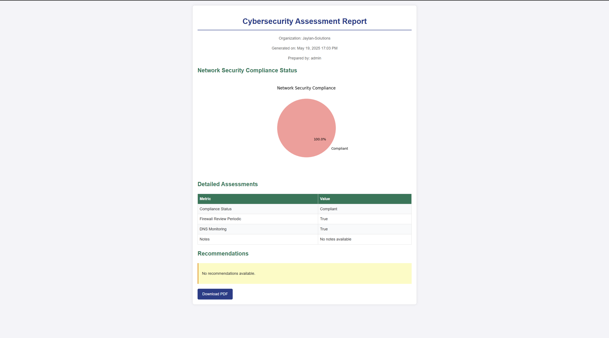

# **Cyber Security Assessment System**

A robust **Web Application** designed to generate comprehensive cybersecurity assessment reports, including **compliance status**, **detailed assessments**, and **actionable recommendations**. This system helps organizations evaluate their security posture across various domains such as:

- Mobile/Web Apps
- APIs
- Firewalls
- Phishing Drills
- Maturity Analysis
- NIST Compliance
- Asset Inventory
- Access Control
- Network Security
- Incident Response

---

## ⭐ Features

- Generates detailed cybersecurity reports with **visual pie charts** and **histograms**
- Supports **individual** and **overall assessment** reports
- Provides **actionable recommendations** to improve security posture
- Includes **PDF export** functionality for easy sharing
- Tracks **compliance status** and **trends over time**

---

## ✅ Prerequisites

- **Python 3.8+**
- **Django 4.2.7**
- **Git**
- Required Python packages listed in `requirements.txt`

---

## ⚙️ Setup Instructions

Follow these steps to set up and run the system locally:

### 1. Clone the Repository

git clone https://github.com/JayMwakideu/Cyber-Security-Assessment-System.git
cd Cyber-Security-Assessment-System

## **2. Create and Activate a Virtual Environment**

python -m venv venv
source venv/bin/activate  # On Windows: venv\Scripts\activate

## **3. Install Dependencies**

pip install -r requirements.txt

## **4. Set Up Environment Variables**

Copy `.env.example` to `.env` and fill in your values (e.g., `SECRET_KEY`, `DATABASE_URL`):

cp .env.example .env

Then edit `.env` with your **Django secret key** and **database configuration**.

## **5. Run Migrations**

python manage.py migrate

## **6. Create a Superuser (for admin access)**

## **7. Start the Development Server**

python manage.py runserver 0.0.0.0:8080

## **Access the Application**

Open your browser and go to:
**[http://localhost:8080](http://localhost:8080)**

Log in with the superuser credentials to access the dashboard at:
**/dashboard/**

## **Usage**

* **Log In**: Use the superuser account or sign up via `/signup/`
* **Dashboard**: Navigate to `/dashboard/` to view an overview of assessments, compliance percentages, and trends
* **Reports**: Go to `/report-menu/` and select an organization and report type (e.g., `/report/1/overall/`)
* **Download**: Use the **"Download PDF"** button on report pages to export reports

## **Screenshots**

### **Dashboard Overview**

The dashboard provides a visual summary of your cybersecurity assessments.

Displays pie charts for compliance status (e.g., Mobile/Web, API, Firewall), 6-month trend analysis, and a table of organization-specific compliance data.

## **Report Examples**

### **Overall Report**

Aggregates compliance across all categories with pie chart & detailed breakdowns. Recommendations address specific gaps.

### **API Report**

Covers API security: auth mechanisms, rate limiting, vulnerabilities. Includes a pie chart and key metrics.

### **Mobile/Web Report**

Assesses platforms (iOS, Android, Web), encryption, and third-party libraries.

### **Firewall Report**

Evaluates firewall rules, last review dates, and logging status.

### **Phishing Report**

Analyzes drill results: click rates, awareness scores. Includes histogram of user responses.

### **Maturity Report**

Shows organizational maturity across cybersecurity domains with bar chart breakdown.

### **NIST Report**

Compares assessment data against NIST controls and highlights compliance status.

### **Asset Inventory Report**

Shows inventory counts (laptops, servers, etc.) with pie chart summaries.

### **Access Control Report**

Assesses MFA usage, password policy, and RBAC compliance.

### **Network Security Report**

Analyzes VLANs, firewalls, DNS monitoring, and perimeter defenses.

### **Incident Response Report**

Reviews response plans, drills, and incident readiness.

## **Contact**

* **LinkedIn**: [linkedin.com/in/jaymwakideu](https://linkedin.com/in/jaymwakideu)

## **Customization**

Looking for a tailored version for your organization? Get in touch via **LinkedIn** or **email** to discuss your needs.

## **Support the Project**

If this tool helps you, consider supporting its development:

**Buy Me a Coffee**: [https://buymeacoffee.com/mwakideu](https://buymeacoffee.com/mwakideu)

## **Future Developments: Vulnerability Assessment Expansion**

Upcoming features will expand the system’s vulnerability assessment capabilities to include:

URL, IP, and Hash Scanning: Paste URLs, IP addresses, and file hashes for analysis through integrations with VirusTotal and other threat intelligence platforms.

Mobile App Analysis: Upload APK (Android) and iOS apps for automated assessment of security issues, permissions, and embedded threats.

Firewall Exposure Testing: Scan public firewall configurations and ports to detect exposure risks and misconfigurations.

Public-Facing Services Testing: Identify exposed assets and services like web servers, APIs, databases, and IoT devices.

TLS/SSL Certificate Checks: Validate certificate strength, expiry, and implementation issues.

CMS Vulnerability Checks: Automatically detect known CVEs in CMS platforms (e.g., WordPress, Joomla).

Cloud Security Evaluation: Assess public cloud buckets, IAM policies, and open storage configurations.

Vulnerability Assessment Form: Download a standard PDF form to conduct manual or offline assessments.

📄 Download Vulnerability Assessment Form (PDF) 
